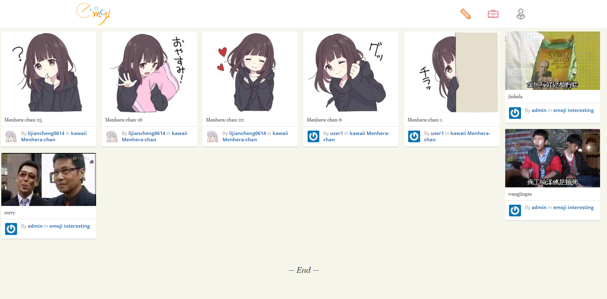
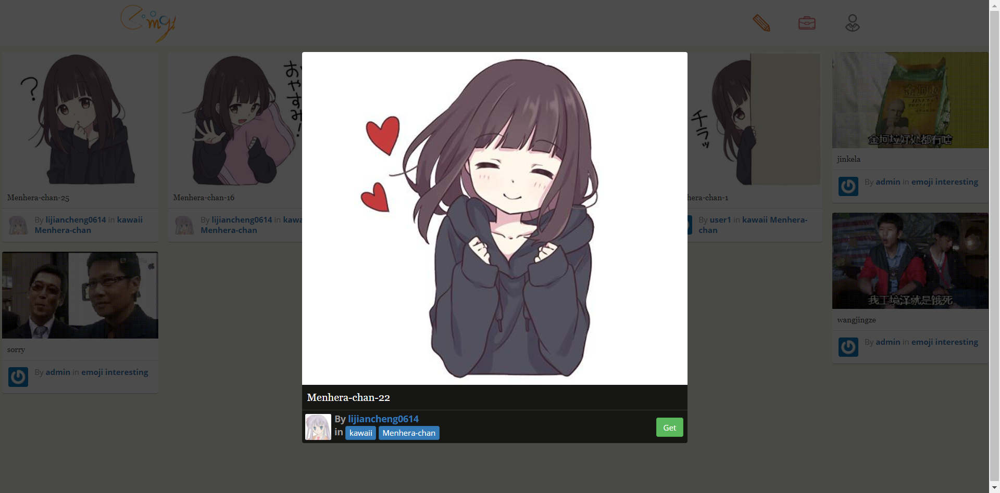
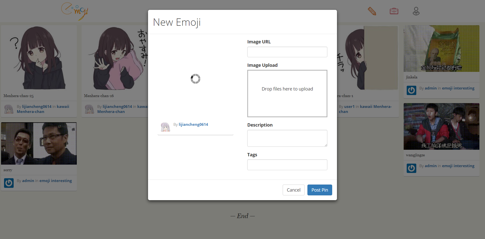

# Emoji

一个表情包分享网站。

1. 用户可以上传自己设计的表情包，也可以购买他人的表情包。

2. 自由选择：表情包可选择其中几个而无需打包购买。

3. 表情分类：表情包有分类的标签，我们会进行个性化推荐。

4. 虚拟交易：使用虚拟货币进行交易，货币通过评论、上传和签到等方式获取。

5. 灵感创作：提供简单的二次创作平台。


## Usage

1. Install requirements.

```python
pip install -r requirements.txt
```

2. Create database.

```python
python manage.py migrate
```

3. Run the server.

```python
python manage.py runserver
```

4. Visit http://127.0.0.1:8000/


## Screenshots






